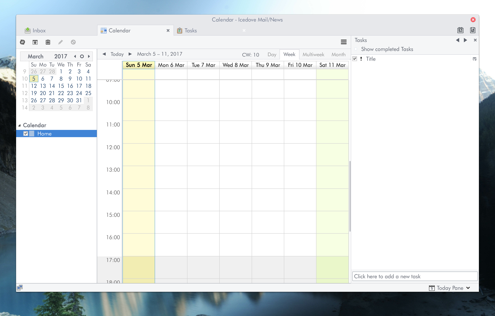

# Arc Theme integration for Thunderbird (alpha v0.2.0)

> Tested in Thunderbird 45.6.0, GNOME 45.6.0, Debian GNU/Linux 9, Surface Pro 4, Arc Theme 20161119-1.

> Stability in other versions is not guaranteed, but you can still try.

## Features

 - Changes the appearance of tabs in the application to match the ones found in the official [Arc Firefox Theme](https://github.com/horst3180/arc-firefox-theme).

It does not change the icons (yet?).

## Installation

 - Download the latest release (.xpi file) from [here](https://github.com/JD342/arc-thunderbird-integration/releases);
 - In Thunderbird, go to menu -> Add-ons;
 - There should be a button with a gear icon on the left side of the "Search all add-ons" bar, click it;
 - Click "Install Add-on from file...";
 - Find and select the downloaded .xpi file and install it;
 - restart Thunderbird;
 - enjoy.

## License

The content in this repository is licensed under GPLv3.

## History

  - 0.2.0 2017/03/07
    - Integration packaged as an add-on
  - 0.1.0 2017/03/05
    - Initial release
